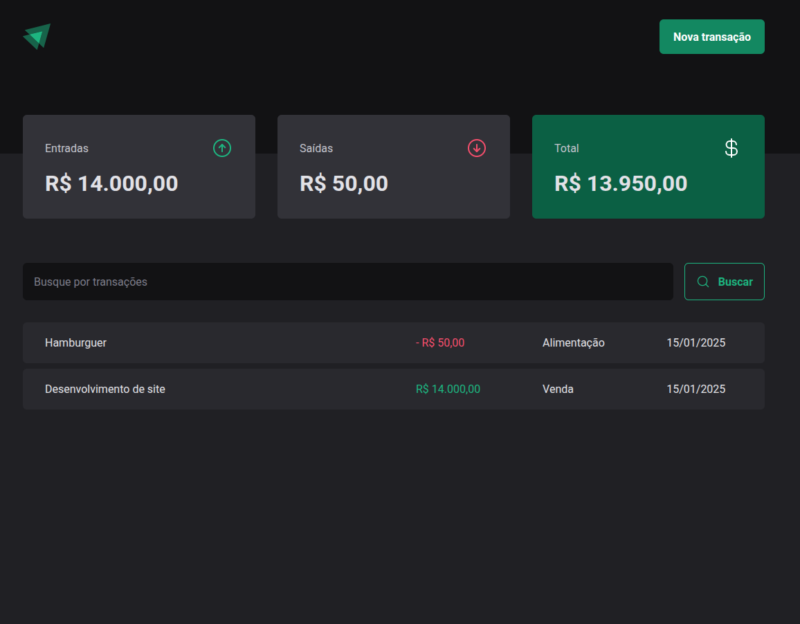
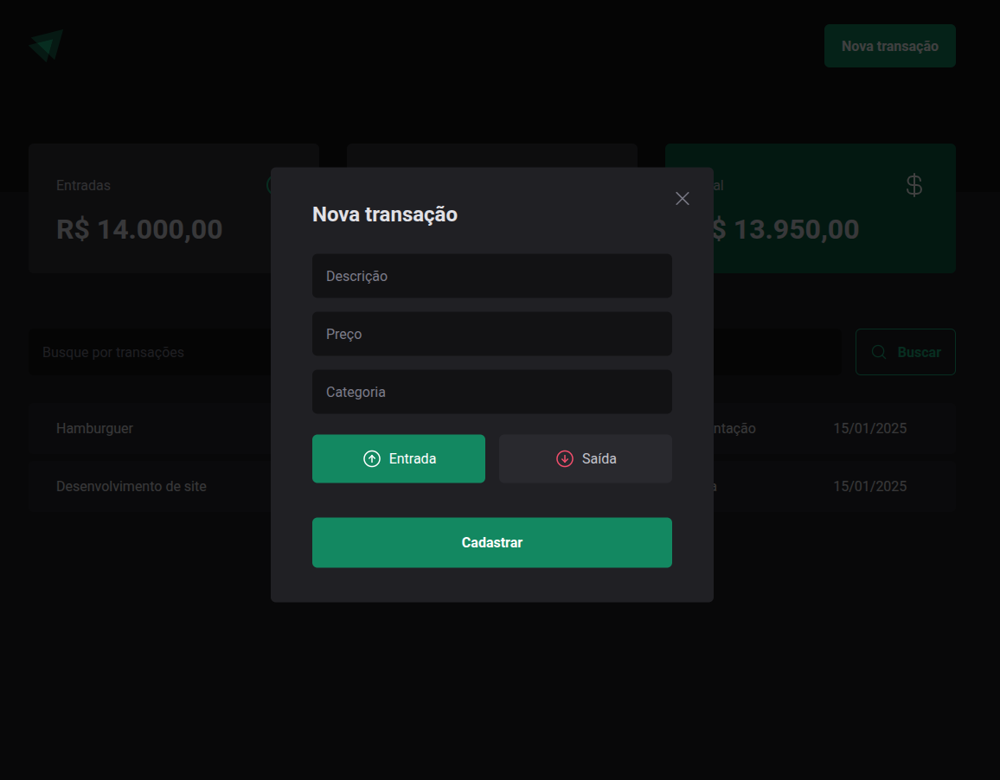

# **DT Money**

Este projeto foi desenvolvido durante o curso **_Ignite_** da **Rocketseat**, com o objetivo de criar uma aplicação de **controle financeiro pessoal**. O foco foi aplicar **boas práticas de desenvolvimento** e utilizar **tecnologias modernas** para criar interfaces funcionais e intuitivas.

---

## 🚀 **Tecnologias Usadas**

### **Frontend**

- **React**: Biblioteca JavaScript para construção de **interfaces modernas**.
- **TypeScript**: Para **tipagem estática** e maior **segurança** no desenvolvimento.
- **Styled-Components**: Biblioteca para estilização dinâmica com **componentização**.
- **Vite**: Ferramenta para **build rápida** e **desenvolvimento ágil**.

### **Backend**

- **JSON-Server**: Simulação de uma API para gerenciar os dados das transações.

### **Outras Ferramentas e Bibliotecas**

- **React Hook Form**: Para **manipulação de formulários** com validação eficiente.
- **Zod**: Validação de dados e estruturação dinâmica de **schemas**.
- **Context API**: Gerenciamento de estados globais de forma **eficiente**.
- **ESLint e Prettier**: Garantia de **qualidade** e **consistência** no código.

---

## ⚙️ **Funcionalidades**

- **📈 Cadastro de Transações**: Registre entradas e saídas financeiras detalhadas.
- **🔍 Busca de Transações**: Filtro por descrição utilizando o **searchParams**.
- **💰 Cálculo de Saldo**: Exibição de entradas, saídas e saldo total.
- **📱 Interface Responsiva**: Layout adaptado para **desktop** e **dispositivos móveis**.

---

## 🎯 **Objetivos**

- Consolidar o uso de **React** e **Styled-Components** na criação de interfaces.
- Trabalhar com **APIs simuladas** utilizando **JSON-Server**.
- Aplicar **Context API** para gerenciar dados globais.
- Implementar validações eficientes com **React Hook Form** e **Zod**.

---

## 🖼 **Layout do Projeto**

**Dashboard com Resumo Financeiro**  

**Criação de novas transações**  

